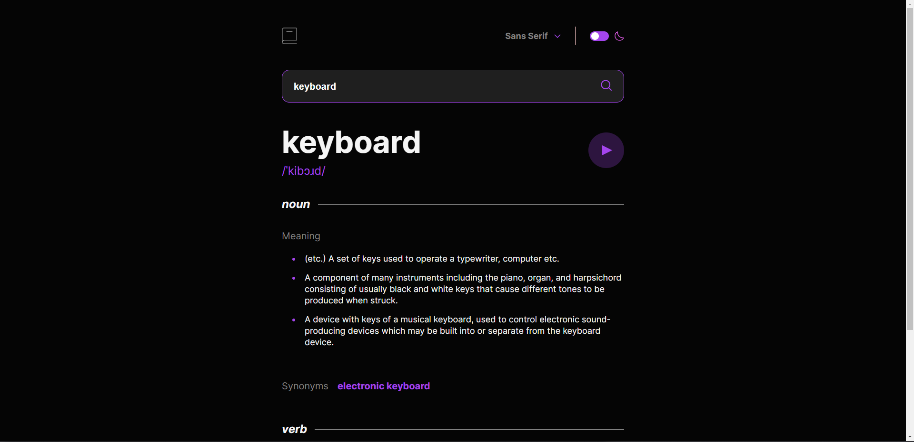
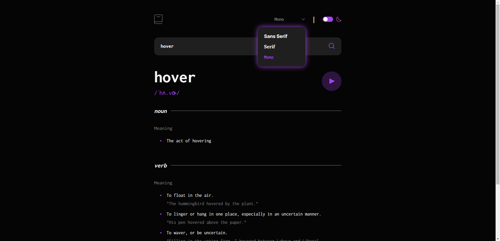
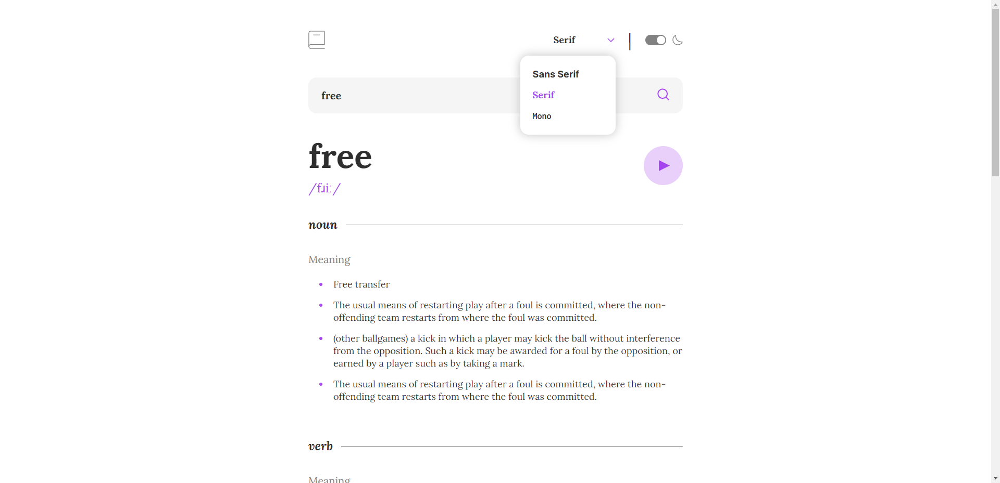

# Frontend Mentor - Dictionary web app solution

This is a solution to the [Dictionary web app challenge on Frontend Mentor](https://www.frontendmentor.io/challenges/dictionary-web-app-h5wwnyuKFL). Frontend Mentor challenges help you improve your coding skills by building realistic projects. 

## Table of contents

- [Overview](#overview)
  - [The challenge](#the-challenge)
  - [Screenshot](#screenshot)
  - [Links](#links)
- [My process](#my-process)
  - [Built with](#built-with)
  - [What I learned](#what-i-learned)
  - [Continued development](#continued-development)
  - [Useful resources](#useful-resources)
- [Author](#author)


## Overview

### The challenge

Users should be able to:

- Search for words using the input field
- See the Free Dictionary API's response for the searched word
- See a form validation message when trying to submit a blank form
- Play the audio file for a word when it's available
- Switch between serif, sans serif, and monospace fonts
- Switch between light and dark themes
- View the optimal layout for the interface depending on their device's screen size
- See hover and focus states for all interactive elements on the page
- **Bonus**: Have the correct color scheme chosen for them based on their computer preferences. _Hint_: Research `prefers-color-scheme` in CSS.

### Screenshot

- Main: 

- Dropdown-mono: 

- Light-theme-serif 

### Links

- Solution URL: [https://github.com/Jo-cloud85/dictionary-web-app.git](https://github.com/Jo-cloud85/dictionary-web-app.git)
- Live Site URL: [https://jo-cloud85.github.io/dictionary-web-app/](https://jo-cloud85.github.io/dictionary-web-app/)


## My process

### Built with

- Semantic HTML5 markup
- CSS custom properties
- Flexbox
- CSS Grid
- Mobile-first workflow
- [Styled Components](https://styled-components.com/) - For styles


### What I learned

- Understand the structure of a typical API response first before continuing

The hardest part of this challenge was realising that the json data of dictionary API response was not as striaghtforward and consistent as expected.

Firstly, for example, there are a few items/dictionaries within the major key 'phonetics'. And within each dictionary, there are keys like 'text' and 'audio' which are the ones that we need in this challenge. However, some of the values of these keys are either missing or repeated. And the pattern/output is not the same for different words. Ultimately, you will want to only extract the first instance of the dictionary where both keys are available and there are valid values. Thus in that loop, a 'break' is necessary.

The same thing applies for the next major key we want to look at - 'meanings'. 

Here, it is important to know that the output is not as simple as just noun and verb only. There are adverbs, adjectives, interjections, etc for some of the words and you have to display all of them accordingly. Moreover, like 'phonetics', for each type and in each type's definition, the value 'example' may or may not be available. 

Similarly, 'synonyms' and 'antonyms' - direct child keys of 'meanings'- may or may not be available as well.

Thus, it makes a lot of sense to create a div template or structure for sub-divs of definitionSection for every partofSpeech available and then use Javascript to check for the availability of data in the API response and then add (or remove) the divs, elements and styles accordingly. Refer to the next point for the template.

In addition, in the case of 'meanings', sometimes, there is a repeat of the value for the key 'partOfSpeech'. This means that for example, if the key 'meanings' is a list of 5 dictionaries, there can be 2 instances where 'partOfSpeech' value is 'noun'. In this case, you have to merge the values of the 2 dictionaries.


- Learning how to integrate audio


- Understand and draft the overall structure that you will be creating through javascript

```
<!-- This is the overall structure for sub-divs of definitionSection for every partofSpeech available, incl adverb, adjectives -->
<div class="part-of-speech" id="#">
  <span class="type"><em>#</em><hr></span>
  <span class="gray-text">Meaning</span>
  <ul>
    <li>
      <p></p>
      <span class="example"></span>
    </li>
  </ul>
  <div class="synonym-div">
    <span class="gray-text synonym-title" id="#-synonym-title"></span>
    <span class="synonym-words" id="#-synonym"></span>
  </div>
  <div class="antonym-div">
    <span class="gray-text antonym-title" id="#-antonym-title"></span>
    <span class="antonym-words" id="#-antonym"></span>
  </div>
</div>

<!-- To be added only after appending all the sub-divs>
<hr id="full-line">

<div id="source-section">
  <span id="gray-text-source">Source</span>
  <a href="https://en.wiktionary.org/wiki/keyboard" target="_blank">https://en.wiktionary.org/wiki/keyboard</a>
</div>
```

### Continued development

This challenge has a potential to develop into a fully functional app with the javascript run by the server side which will be a major part of my continued development.

### Useful resources

- [Custom dropdown select menu](https://www.darkcode.info/2022/05/how-to-create-custom-select-menu-using.html) - This helped me for learning how to customize drop-down menu.


## Author

- Frontend Mentor - [@Jo-cloud85](https://www.frontendmentor.io/profile/Jo-cloud85)
